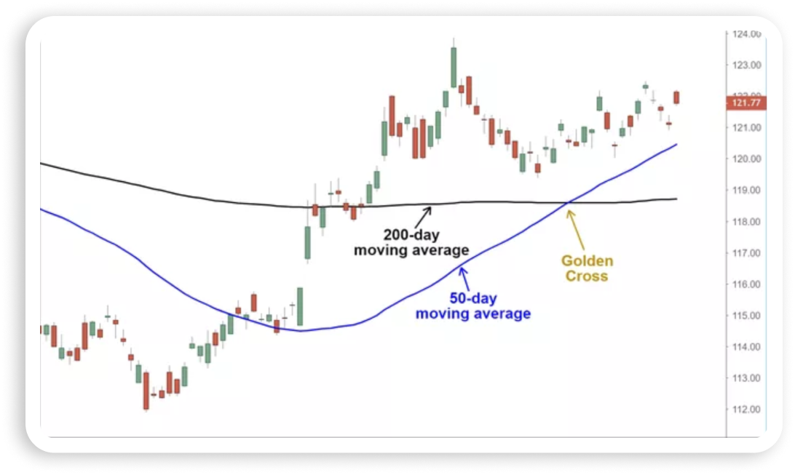

# Genuine-Technology-Research-Ltd.

## Installation

## (1) Create virtual environment

### Windows
```bash
python -m venv .venv
.venv\Scripts\activate
```
### Mac/Linux
```bash
python3 -m venv .venv
source .venv/bin/activate
```
## (2) Install dependencies
```bash
pip install -r requirements.txt
```

## Task 1:
### Golden Cross Trading Strategy (Python + yfinance)




A simple algorithmic trading strategy using the **Golden Cross (MA50 & MA200)** technique.

This project downloads stock data from Yahoo Finance, calculates moving averages, simulates trades, and evaluates profit/loss automatically.


## Features

 Download historical stock data (yfinance)  
 Data cleaning (duplicate removal + NaN handling)  
 50-day & 200-day Moving Average  
 Golden Cross → Buy  
 Death Cross → Sell  
 Automatic profit/loss calculation  
  

---

## Project Structure


```yaml
Task_1/
│
├── trend.py # TradingStrategy class
├── main.py # run script
├── data.csv
```

---


▶️ How to Run
Run the strategy
python main.py

🧠 How It Works
Step 1 – Download data
yf.download()

Step 2 – Clean data

Remove duplicates

Forward fill NaN

Step 3 – Indicators
MA50  = 50-day moving average
MA200 = 200-day moving average

Step 4 – Strategy Logic
Condition	Action
MA50 > MA200	BUY
MA50 < MA200	SELL
Step 5 – Profit Calculation
profit = (sell_price - buy_price) × shares


Positive → Profit
Negative → Loss

🖥 Example Output
BUY 32 shares at 150 on 2020-06-01
SELL 32 shares at 170 on 2021-02-10

====== Strategy Result ======
Net Profit: $640.00

🔧 Customization

Change stock:

TradingStrategy("TSLA", "2020-01-01", "2024-01-01", 10000)


Change budget:

budget=10000